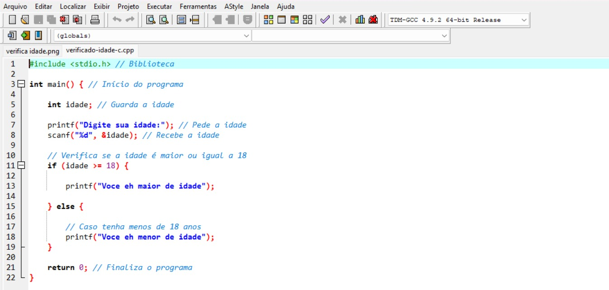

# Programação em C

<p align="center">
  
</p>

<p align="center">
  Repositório para guardar meus estudos, exercícios e códigos desenvolvidos em C.
</p>

## Conteúdos

* Variáveis
* Tipos de dados
* Entrada e saída
* Operadores
* `if`, `else`
* `switch case`
* `for`
* `while`
* `do while`
* Funções
* Arrays
* Strings
* Ponteiros
* Structs
* Arquivos
* Bibliotecas
* Memória
* Projetos

## Estrutura

```text
c/
├── fundamentos/
├── condicionais/
├── loops/
├── funcoes/
├── arrays/
├── ponteiros/
├── structs/
├── arquivos/
└── projetos/
```

## Compilar

```bash
gcc programa.c -o programa
```

## Executar

```bash
./programa
```

## Objetivo

Guardar e organizar minha evolução no aprendizado de programação em C através de exercícios e projetos práticos.

## Status

🚧 Em desenvolvimento.
