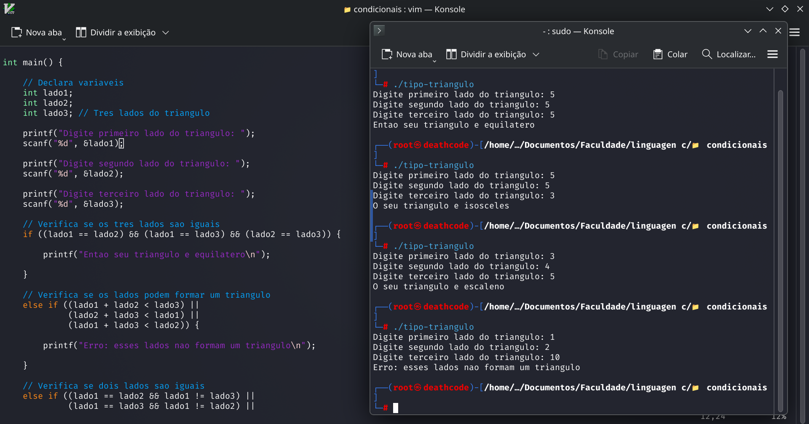

<p align="center">
  
</p>

<h1 align="center">Classificação de Triângulos</h1>

<p align="center">
  Programa desenvolvido em C para identificar o tipo de triângulo a partir de seus três lados.
</p>

## 📌 Sobre o projeto

Este projeto foi desenvolvido para praticar **estruturas condicionais em linguagem C**.

O programa recebe três valores representando os lados de um triângulo e determina se ele é:

- 🔺 **Equilátero** — três lados iguais
- 🔺 **Isósceles** — dois lados iguais
- 🔺 **Escaleno** — três lados diferentes

O programa também verifica se os valores informados podem realmente formar um triângulo.

## 🧠 Conceitos praticados

- Variáveis
- Tipo `float`
- Entrada de dados com `scanf`
- Saída de dados com `printf`
- Estruturas condicionais
- `if`, `else if` e `else`
- Operadores relacionais
- Operadores lógicos

## 📐 Regra para formar um triângulo

Para três lados `A`, `B` e `C` formarem um triângulo:

```text
A + B > C
A + C > B
B + C > A
```

## 🔍 Classificação

| Tipo | Condição |
|---|---|
| Equilátero | A = B = C |
| Isósceles | Dois lados iguais |
| Escaleno | Todos os lados diferentes |

## ▶️ Como executar

Compile o programa:

```bash
gcc classificacao_triangulos.c -o classificacao_triangulos
```

Execute:

```bash
./classificacao_triangulos
```

## 🖼️ Resultado



## 📂 Arquivos

- `classificacao_triangulos.c` — código-fonte do programa.
- `resultado.png` — captura do resultado da execução.

---

📚 **Categoria:** Condicionais em C  
🎯 **Objetivo:** Praticar estruturas condicionais e operadores lógicos através da classificação de triângulos.