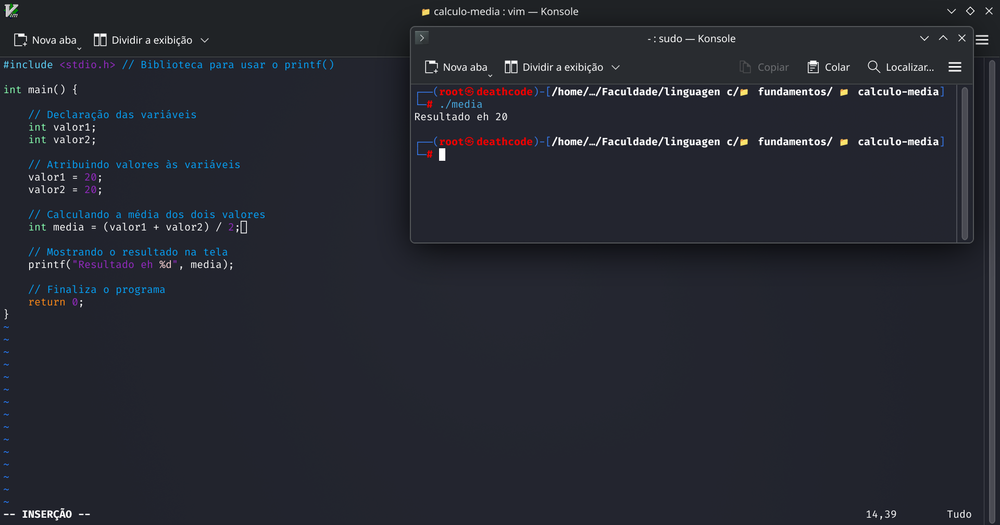

<p align="center">
  
</p>

<h1 align="center">Média de Dois Valores</h1>

<p align="center">
  Programa desenvolvido em C para calcular a média aritmética de dois valores.
</p>

## 📌 Sobre o projeto

Este projeto foi desenvolvido para praticar os **fundamentos da linguagem C**, utilizando variáveis, atribuição de valores e operações matemáticas.

O programa recebe dois valores definidos no código e calcula a média entre eles.

## 🧮 Fórmula utilizada

```text
Média = (Valor 1 + Valor 2) / 2
```

## 🧠 Conceitos praticados

- Declaração de variáveis
- Tipo `int`
- Atribuição de valores
- Operações matemáticas
- Divisão
- Saída de dados com `printf`
- Função `main`

## 💻 Exemplo

```text
Valor 1 = 20
Valor 2 = 20

Resultado eh 20
```

## ▶️ Como executar

Compile o programa:

```bash
gcc media_dois_valores.c -o media_dois_valores
```

Execute:

```bash
./media_dois_valores
```

## 🖼️ Resultado



## 📂 Arquivos

- `media_dois_valores.c` — código-fonte do programa.
- `resultado.png` — captura do resultado da execução.

---

📚 **Categoria:** Fundamentos em C  
🎯 **Objetivo:** Praticar variáveis, atribuição e operações matemáticas em C.