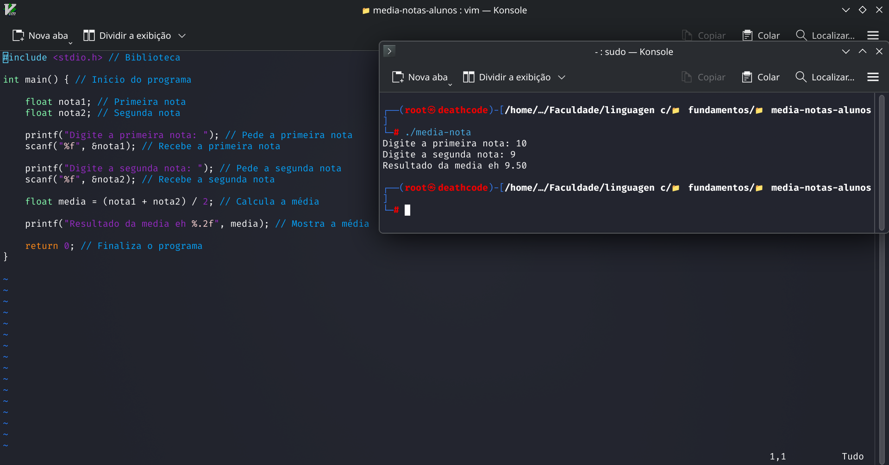

<p align="center">
  
</p>

<h1 align="center">Média de Notas de Alunos</h1>

<p align="center">
  Programa desenvolvido em C para receber notas e calcular a média de um aluno.
</p>

## 📌 Sobre o projeto

Este projeto foi desenvolvido para praticar **fundamentos da linguagem C**, utilizando entrada de dados, variáveis e operações matemáticas.

O programa solicita três notas ao usuário e calcula a média aritmética.

## 🧮 Fórmula utilizada

```text
Média = (Nota 1 + Nota 2 + Nota 3) / 3
```

## 🧠 Conceitos praticados

- Declaração de variáveis
- Tipo `float`
- Entrada de dados com `scanf`
- Saída de dados com `printf`
- Operações matemáticas
- Divisão
- Função `main`

## 💻 Exemplo de execução

```text
Digite a primeira nota: 8
Digite a segunda nota: 7
Digite a terceira nota: 9

Media do aluno: 8.00
```

## ▶️ Como executar

Compile o programa:

```bash
gcc media_notas_alunos.c -o media_notas_alunos
```

Execute:

```bash
./media_notas_alunos
```

## 🖼️ Resultado



## 📂 Arquivos

- `media_notas_alunos.c` — código-fonte do programa.
- `resultado.png` — captura do resultado da execução.

---

📚 **Categoria:** Fundamentos em C  
🎯 **Objetivo:** Praticar entrada de dados, variáveis e operações matemáticas através do cálculo da média de notas.