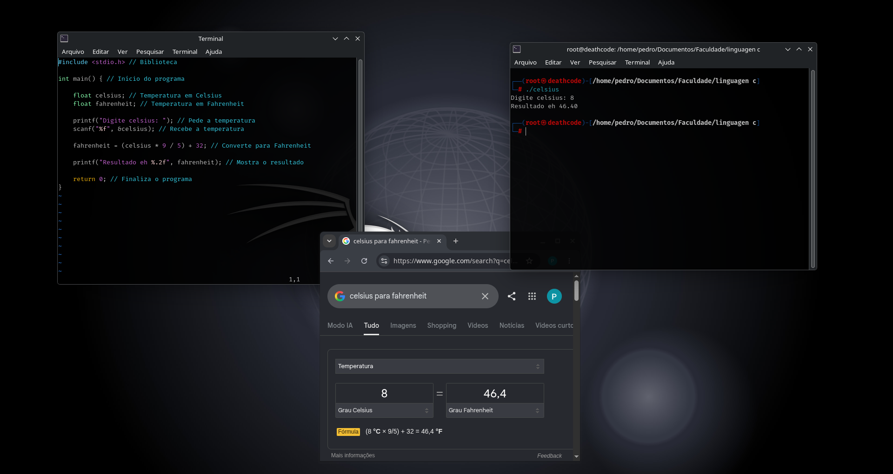

<p align="center">
  
</p>

<h1 align="center">🌡️ Conversor Celsius → Fahrenheit</h1>

## 📌 Sobre o projeto

Este é um exercício desenvolvido em **linguagem C** para praticar conceitos fundamentais de programação.

O programa recebe uma temperatura em **Celsius** e realiza a conversão para **Fahrenheit**.

## 🧮 Fórmula utilizada

```text
F = (C × 9 / 5) + 32
```

Onde:

- `C` = temperatura em Celsius
- `F` = temperatura em Fahrenheit

## 💻 Conceitos praticados

- Variáveis
- Tipo `float`
- Entrada de dados com `scanf`
- Saída de dados com `printf`
- Operações matemáticas
- Formatação de números

## ▶️ Como executar

```bash
gcc celsius_fahrenheit.c -o celsius_fahrenheit
./celsius_fahrenheit
```

## 🖼️ Resultado



## 📂 Arquivos

- `celsius_fahrenheit.c` — código-fonte do conversor.
- `resultado.png` — captura do resultado da execução.

---

📚 **Categoria:** Fundamentos em C  
🎯 **Objetivo:** Praticar entrada de dados, variáveis e operações matemáticas.